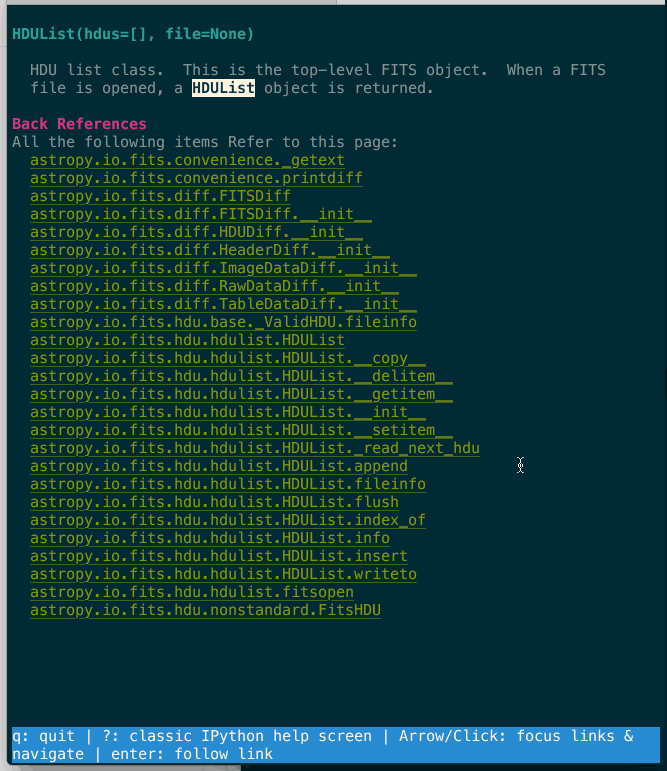
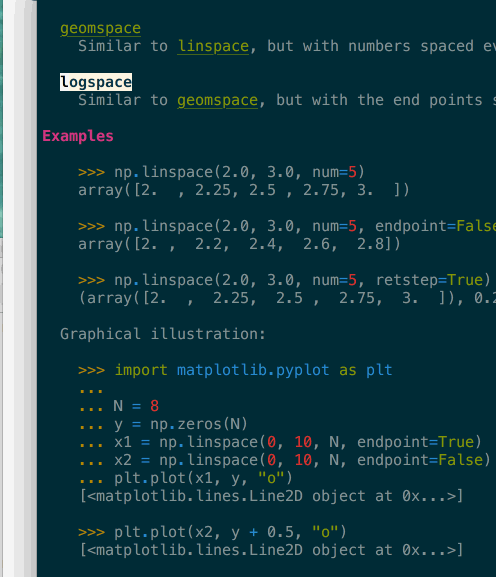
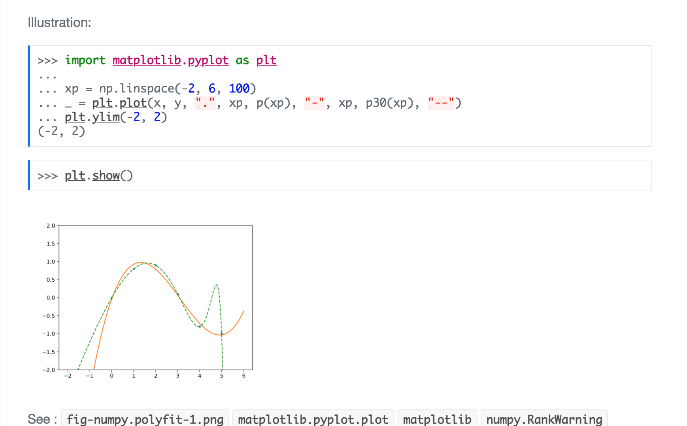
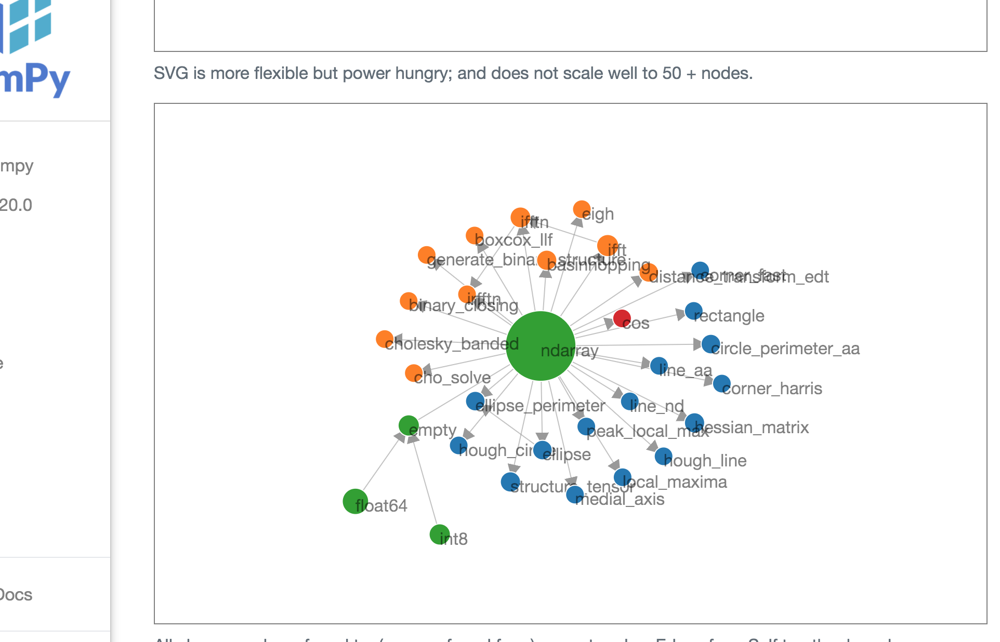
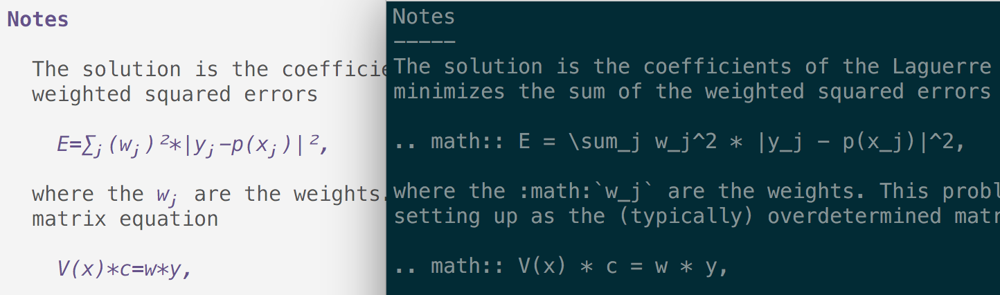

# Papyri

**Papyri** is a set of tools to build, publish (future functionality - to be done), install and render
documentation within IPython and Jupyter.

Papyri allows:
- bidirectional crosslinking across libraries, 
- navigation, 
- proper reflow of user docstrings text,
- proper reflow of inline images (when rendered to html),
- proper math rendering (both in terminal and html),
- and more.

## Motivation

See some of the reasons behind the project on [this blog post](https://labs.quansight.org/blog/2021/05/rethinking-jupyter-documentation/).

Key motivation is building a set of tools to build better documentation for Python project.
  - Uses an opinionated implementation to enable better understanding more about the structure of your project.
  - Allow automatic cross link (back and forth) between documentation across python packages.
  - Use a documentation IR (intermediate representation), to separate building the docs from rendering the docs in many contexts.

This approach should hopefully allow a conda-forge-like model, where projects upload their IR to a given repo, a _single
website_ that contains multiple project documentation (without sub domains) can be buildt with better cross links between
projects, and _efficient_ page rebuild.

This should also allow displaying reader documentation on _non html_ backend (think terminal), or provide documentation in an
IDE (Spyder/Jupyterlab), without having to iframe it.

## Overview Presentation

And this [small presentation at CZI EOSS4 meeting in early november 2021](https://docs.google.com/presentation/d/1sSh44smooCiOlj0-Zrac9n5KX0K_ABBFznDmMIwUnbM/edit?usp=sharing).

## Screenshots

<detail>
<summary>Click to expand</summary>
Navigating astropy's documentation from within IPython, note that this include
forward ref but also backward reference (which pages link to current page)



Type inference and keyboard navigation in terminal: Directive are properly
rendered in terminal, examples are type inferred, clicking (or pressing enter)
on highlighted token would open said page (backspace navigate back).



Jupyter Notebook and Lab pager can render HTML it should be possible to have
inline graph and images when using jupyter inline help (to be implemented), in
terminals we replace inline images with a button/link to open images in an
external viewer (quicklook, evince, paint...)



Papyri has complete information about which page link to which page; this allows
to create local graph of which page mention each other to find related topics.

Local connectivity graph for `numpy.zeros` (d3js, draggable, clickable),
numpy.zeroes links to (or is linked from) by all dots present there. Green other
numpy functions; Blue skimage functions, orange: scipy, red: xarray. Arrow
between dots indicate those pages link each other (for example ndarray is linked
from xarray.cos), and dot size represent the popularity of a page.



Math are properly rendered even in terminal, here `polyfit` in IPyhton with
papyri enabled (left) and disabled (right).


</detail>

## Installation (not fully functional):

Some functionality are not yet available when installing from PyPI,
For now you need a dev-install (see next section) to access all features.

You'll need Python 3.8 or newer, otherwise pip will tell you it can't find any matching distribution.

Pip install from Pypi:

```bash
$ pip install papyri
````

Install given package documentation:

```bash
$ papyri install package_name [package_name [package_name [...]]]
```

Only numpy 1.20.0, scipy 1.5.0 , xarray 0.17.0, are currently installable and published.
For other packages you will need to build locally which is a much more involved
process.

Run terminal IPython with Papyri as an extension:

```
$ ipython --ext papyri.ipython
```

This will augment the `?` operator to show better documentation (when install with `papyri install ...`

*Papyri does not completely build it's own docs yet but you might be able to view a static rending of it
[here](https://pydocs.github.io/). It is not yet automatically built, so might be out of date.*

### Development install

You may need to get a modified version of numpydoc depending on the stage of development. You will need [pip >
21.3](https://pip.pypa.io/en/stable/news/#v21-3-1) if you want to make editable installs

```
# clone this repo
# cd this repo
pip install -e . 
```

Build the TreeSitter rst parser:

Some functionality require ``tree_sitter_rst``, see run `papyri build-parser`, and CI config file on how to build the tree-sitter
shared object locally.

```bash
$ git clone https://github.com/stsewd/tree-sitter-rst
$ papyri build-parser
```


Note that papyri still uses a custom parser which will be removed in the future to rely mostly on TreeSitter.

## Usage

In the end there should be roughly 3 steps,

 - IR generation (package maintainers).
 - IR installation (end user or via pip/conda)
 - IR Rendering (usually IDE, Cli/webserver)

### IR Generation

This is the step you want to trigger if you are building documentation using Papyri for a library you maintain. Most
likely as an end user you will not have to issue this step and can install pre-published documentation bundles.
This step is likely to occurs only once per new release of a project.

Look at the Toml files in `examples`, this give you example configuration from some existing libraries.


```
$ ls -1 examples/*.toml
examples/IPython.toml
examples/astropy.toml
examples/dask.toml
examples/matplotlib.toml
examples/numpy.toml
examples/papyri.toml
examples/scipy.toml
examples/skimage.toml
```

Right now these files lives in papyri but would likely be in relevant repositories under `docs/papyri.toml` later on.


It is _slow_ on full numpy/scipy, use `--no-infer` see below for a subpar but
faster experience.

Use `papyri gen <path to example file>`

for example:

```
$ papyri gen examples/numpy.toml
```

```
$ papyri gen examples/scipy.toml
```

This will create intermediate docs files in in `~/.papyri/data/<library name>_<library_version>`


### installation/ingestion

The installation/ingestion of documentation bundles is the step that makes all
bundles "aware" of each other, and allow crosslinking/indexing to work.

We ll reserve the term "install" and "installation" when you download pre-build
documentation bundle from an external source and give only the package name
– which is not completely implemented yet.

You can ingest local folders with the following command:


```
$ papyri ingest ~/.papyri/data/<path to folder generated at previous step>
```

This will crosslink the newly generate folder will the existing ones.
Ingested data can be found in  `~/.papyri/ingest/` but you are not supposed to
interact with this folder with tools external to papyri.

There is currently a couple of pre-built documentation bundle that can be
pre-installed, but are likely to break with each new version of papyri, we
suggest for you to use the developer install and ingestion procedure for now.


## Rendering

The last step of the papyri pipeline is to render the docs, or the subset that
is of interest to you. This will likely be done by your favorite IDE, probably
just in time when you explore documentation for you. Nonetheless we've
implemented a couple of external render to help debug issues.

WARNING:

Many render methods current require papyri own docs to be build and ingested
first. 

```
$ papyri gen examples/papyri.toml
$ papyri ingest ~/.papyri/data/papyri_0.0.7  # or any current version
```

Or you can try to pre-install an old papyri doc bundle

```
$ papyri install papyri
```


### Standalone Html rendering


```bash
$ papyri render  # render all the html pages statically in ~/.papyri/html
$ papyri serve-static # start a http.server with the propoer root to serve above files.
```

```bash
$ papyri serve # start a server that will render the pages on the fly (nice to debug or iterate on theme, rendering)
```


### Ascii  terminal rendering


```
$ papyri ascii <fully qualified names> # try to render in the terminal.
```

The next step uses urwid to provide a browsable interface in terminal.

```
$ papyri browse <fully qualified name> # urwid documentation browser.
```

Hacking on scrapping libraries `papyri gen --no-infer [...]` will skip type
inference of examples. `--exec` option need to be passed to try to execute examples.

## Papyri - Name's meaning

See the legendary [Villa of Papyri](https://en.wikipedia.org/wiki/Villa_of_the_Papyri), who get its name from it's
collection of many papyrus scrolls.


## Legacy (MISC/OLD) documentation (Inaccurate):


#### generation (papyri gen ),

Which collect the documentation of a project into a doc-bundle; a number of
doc-blobs (currently json file), with a defined semantic structure, and
some metadata (version of the project this documentation refers to, and
potentially some other blobs)

During the generation a number of normalisation and inference can and should
happen, for example

  - using type inference into the `Examples` sections of docstrings and storing
    those as pairs (token, reference), so that you can later decide that
    clicking on `np.array` in an example brings you to numpy array
    documentation; whether or not we are currently in the numpy doc.
  - Parsing "See Also" into a well defined structure
  - running Example to generate images for docs with images (not implemented)
  - resolve package local references for example building numpy doc
    "`zeroes_like`" is non ambiguous and shoudl be Normalized to
    "`numpy.zeroes_like`", `~.pyplot.histogram`, normalized to
    `matplotlib.pyplot.histogram` as the **target** and `histogram` as the text
    ...etc.

The Generation step is likely project specific, as there might be import
conventions that are per-project and should not need to be repeated (`import
pandas as pd`, for example,)

#### Ingestion (papyri ingest)

The ingestion step take doc-bundle and/or doc-blobs and add them into a graph of
known items; the ingestion is critical to efficiently build the collection graph
metadata and understand which items refers to which; this allow the following:

 - Update the list of backreferences to a docbundle
 - Update forward references metadata to know whether links are valid.

Currently the ingestion loads all in memory and update all the bundle in place
but this can likely be done more efficiently.

A lot more can likely be done at larger scale, like detecting if documentation
have changed in previous version so infer for which versions of a library this
documentation is valid.

There is also likely some curating that might need to be done at that point, as
for example, numpy.array have an extremely large number of back-references.


### tree sitter info.

https://tree-sitter.github.io/tree-sitter/creating-parsers


### When things don't work !


#### `SqlOperationalError`:

- The DB schema likely have changed, try: `rm -rf ~/.papyri/ingest/`.

#### Can't build tree-sitter:

An error occurred trying to build-tree-sitter with clang, you likely have a conda environment. Install all the compilers
in the current conda env:

```
conda install compilers
```


